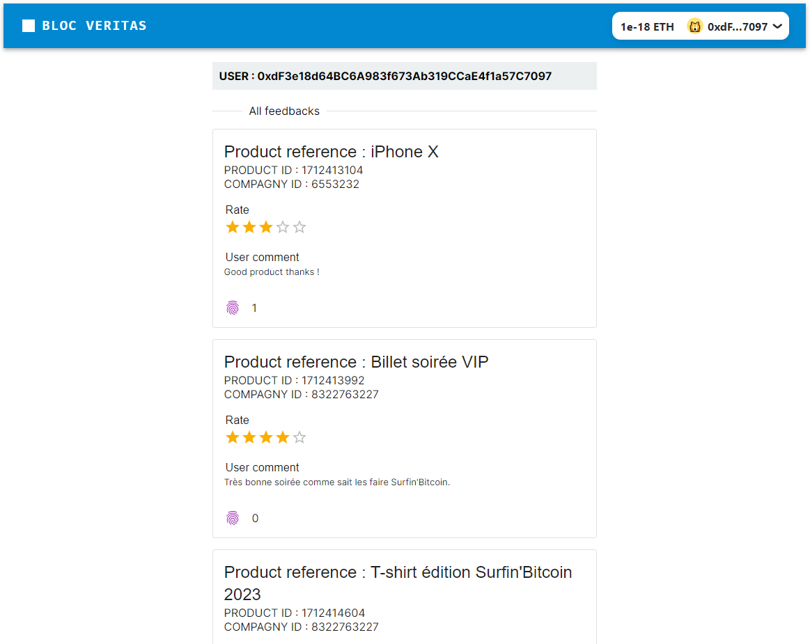

# Bloc Veritas

- Lien vidéo : https://github.com/lmsenanayake/alyra/tree/main/6.%20Dapp/Projet3/final/demo.mp4 
- Lien déploiement de l'application : https://voting-brown.vercel.app/ 
- Lien de déploiement du SM sur sepolia : https://sepolia.etherscan.io/address/0x56f60b987A5ED3114359fCb4D20e96e1E1a0c9A9

Développeur :  
Bafode MINTE

## Détails

### Contract
Le contrat a été développé en solidity sur hardhat et remix.

### Testing
Les test ont été fait. Toutes les fonctions ont été testées recouvrant 82,61% des branche

 
### Front
Voici la liste de la stack utilisée pour la réalisation du projet
- ReactJs
- NextJs
- MaterialUI
- Wagmi + Viem
- RainbowKit

### DApp Screen 
